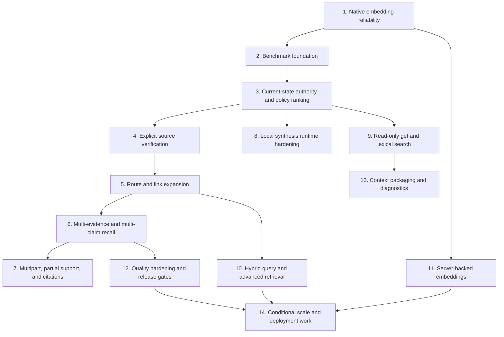

# Recall and Retrieval Roadmap

## Status

Planning roadmap. Slice 1 is the implemented baseline. Every later batch still requires an approved PRD or implementation plan before production work begins.

This document consolidates the planned, deferred, optional, and explicitly unapproved Recall and retrieval features discussed across the Slice 1 PRD, Recall handoff, benchmark PRD, embedding-lifecycle PRD, and archived retrieval plans. It stack-ranks the work into independently deliverable vertical slices.

## Slice 1 baseline

The roadmap starts from the behavior delivered by the Slice 1 branch:

```text
one singular factual question
→ current semantic-index guard
→ local EmbeddingGemma query embedding
→ libSQL exact-cosine search
→ current Markdown hydration
→ bounded eligible evidence
→ one structured local Qwen claim or abstention
→ grounding and public-output validation
→ answered, not_found, or a typed operational failure
```

Slice 1 deliberately has:

- no source retrieval or `--include-sources`;
- no link or route expansion;
- no lexical, policy, or model reranking;
- no multipart or multi-claim answers;
- no public citations, paths, evidence, or diagnostics;
- no hosted synthesis or hosted fallback;
- no synthesis-server or model lifecycle management;
- no server-backed embeddings or approximate vector search.

The existing opt-in live benchmark is exploratory follow-on tooling. It is not a Slice 1 completion gate or part of normal deterministic validation.

## Prioritization principles

The stack rank follows these rules:

1. **Reliability before capability.** Indexing and Recall must be stable before retrieval behavior expands.
2. **Measure before tuning.** Add benchmark cases and baselines before changing ranking, evidence policy, or prompts.
3. **Authority before breadth.** Resolve which memory should win before adding sources, graph expansion, or multipart answers.
4. **One complete vertical slice at a time.** Each batch must improve a public workflow and leave the system releasable.
5. **Markdown remains authoritative.** Indexes, model output, routes, and diagnostics remain derivative.
6. **Curated memory remains the default.** Raw sources and historical material require explicit question intent or options.
7. **Keep internals private by default.** Public citations, diagnostics, providers, and model selection require separate contract decisions.
8. **Use evidence to promote optional work.** Hosted services, approximate search, model reranking, and daemons should remain parked until benchmarks or scale demonstrate a need.

## Roadmap at a glance



The arrows show hard or useful dependencies, not permission to implement multiple batches as one large change.

## Stack-ranked batches

| Rank | Batch                                      | Primary outcome                                           | Status                                        | Depends on               |
| ---: | ------------------------------------------ | --------------------------------------------------------- | --------------------------------------------- | ------------------------ |
|    1 | Native embedding reliability               | Stable indexing and Recall inference lifecycle            | Approved PRD                                  | Slice 1                  |
|    2 | Benchmark foundation                       | A trustworthy feedback loop for later changes             | Approved PRD; existing partial implementation | Slice 1                  |
|    3 | Current-state authority and policy ranking | Correct facts win when memory competes or conflicts       | Planned direction                             | 1–2                      |
|    4 | Explicit source verification               | Users can deliberately answer from raw evidence           | Planned direction                             | 3                        |
|    5 | Route and link expansion                   | Maps and projects guide one-hop discovery                 | Planned direction                             | 2–3                      |
|    6 | Multi-evidence and multi-claim recall      | Complex singular questions can combine grounded facts     | Planned direction                             | 3–5                      |
|    7 | Multipart, partial support, and citations  | Richer public answer contract                             | Deferred contract work                        | 6                        |
|    8 | Local synthesis runtime hardening          | Easier and more resilient local operation                 | Planned direction                             | 1–3                      |
|    9 | Read-only `get` and lexical `search`       | Direct progressive-disclosure tools                       | Draft                                         | 2–3                      |
|   10 | Hybrid `query` and advanced retrieval      | Better large-vault candidate discovery                    | Draft and benchmark-gated                     | 3, 5, 9                  |
|   11 | Server-backed embeddings                   | One persistent local-server inference architecture        | Planned follow-on slice                       | 1                        |
|   12 | Quality hardening and release gates        | Repeatable quality, robustness, and regression thresholds | Draft and benchmark-gated                     | 2, 6                     |
|   13 | Context packaging and diagnostics          | Explainable, token-bounded retrieval workflows            | Optional                                      | 9–12                     |
|   14 | Conditional scale and deployment work      | Capabilities justified only by measured demand            | Unapproved parking lot                        | Relevant earlier batches |

## 1. Native embedding reliability

**Outcome:** indexing and Recall reuse native EmbeddingGemma resources safely instead of repeatedly loading and disposing them.

Implement in this order:

1. Make the live embedding layer lazy so construction, `status`, `inspect`, `install`, and no-op indexing load no native inference resources.
2. Acquire one runtime, model, and embedding context on the first real embedding request.
3. Reuse the session for the owning application-layer lifetime.
4. Serialize concurrent native context use and make first acquisition single-flight.
5. Ensure started non-cancellable native work settles before interruption allows disposal.
6. Finalize context, model, and runtime exactly once and in dependency order.
7. Run the sustained Apple-silicon compatibility proof and document recovery from prior stale locks.

**Exit criteria:** the approved embedding-session-lifecycle PRD is complete, deterministic tests pass, multi-document indexing no longer repeats model acquisition, and the real compatibility probe succeeds or records an explicit upstream blocker.

**Not part of this batch:** parallel contexts, model pools, daemons, workers, idle eviction, or server-backed embeddings.

## 2. Benchmark foundation

**Outcome:** a maintainer can run the complete synthetic corpus through the real public Recall CLI, score every response against authoritative reference answers, and compare the result with one canonical committed baseline.

Implement in this order:

1. Preserve the black-box public CLI boundary and model-free fake-subject tests behind a Recall-subject seam.
2. Migrate the existing 16 questions into one indivisible canonical suite backed by two valid synthetic fixture vaults.
3. Add authoritative reference answers, deterministic status and forbidden-fact scoring, and an independent GPT-5.6 judgment seam for semantic answer quality.
4. Add one canonical Git baseline, updated atomically only through an explicit complete `--update` run.
5. Make the default complete live run show every baseline and new answer, judgment, score, and directional delta.
6. Keep normal CI model-free and require one opt-in live proof for the initial committed baseline.

**Exit criteria:** the full real Recall suite can create and compare against the canonical baseline, reports expose complete per-case and aggregate directional deltas, operational failures cannot corrupt the baseline, and normal CI remains model-free.

**Not part of this batch:** partial runs, filtering, tags, multiple baselines, repeated trials, statistical claims, release thresholds, alternate or calibrated judges, expanded corpora, token or cost reporting, and candidate diagnostics.

## 3. Current-state authority and policy ranking

**Outcome:** Recall chooses the correct authoritative fact when semantically similar memories compete.

Implement in this order:

1. Parse and normalize the minimum owned metadata needed for policy: layer, title, aliases, `status`, `project_status`, section role, and record/historical identity.
2. Add explicit named-project and named-entity disambiguation.
3. Add deterministic Agentic Memory policy ranking after semantic candidate retrieval:
   - exact project, entity, title, alias, and question-intent matches;
   - active or accepted memory for current-state questions;
   - demotion of draft, stale, archived, rejected, and competing-project material;
   - deliberate record and historical-material preference for historical or rationale questions.
4. Add lexical signals only as transparent policy inputs; do not restore a lexical fallback retrieval path.
5. Add per-document max-pooling and advanced evidence/answer deduplication so verbose files and repeated facts cannot crowd out better evidence.
6. Preserve safe abstention when policy cannot resolve a conflict.

**Exit criteria:** benchmarks prove current-versus-stale selection, project/entity disambiguation, historical intent, conflict abstention, and duplicate control without exposing ranking internals publicly.

**Not part of this batch:** Qwen reranking, QMD, approximate search, graph expansion, or sources.

## 4. Explicit source verification

**Outcome:** users can deliberately consult immutable `sources/` evidence without weakening curated-memory defaults.

Implement in this order:

1. Add source eligibility to the internal request model without changing default behavior.
2. Add an explicit public option such as `--include-sources` through an approved contract change.
3. Keep sources excluded before top-K when the option is absent.
4. When sources are enabled, keep active curated memory preferred for ordinary questions.
5. Allow source-only evidence for explicit verification or evidence questions.
6. Apply current conflict, deduplication, provenance, grounding, and public-output safety rules equally to sources.
7. Add source-conflict, source-only, and source-leakage benchmark cases.

**Exit criteria:** default Recall remains source-free; explicit source questions can be answered; stale raw evidence does not silently override curated memory; no source path or internal locator leaks publicly.

**Deferred from this batch:** public citations and source-path output, which require Batch 7’s contract decision.

## 5. Route and link expansion

**Outcome:** root memory, maps, and projects improve discovery by routing Recall to stronger downstream evidence.

Implement in this order:

1. Build a small derived route index from titles, aliases, summaries, `Read when:` clauses, route bullets, resume context, decision logs, next-useful-context sections, and outgoing wikilinks.
2. Classify route-only prose separately from answer-bearing map and project sections.
3. Use strong root, map, or project hits to expand directly linked targets by one hop.
4. Permit answer-bearing project or map content to win when it is more specific than a linked target.
5. Prefer complete downstream note or record evidence over route boilerplate.
6. Prevent unrelated graph neighbors and competing projects from entering the evidence packet.
7. Add route-to-note, route-to-record, root-route, project-state, map-framing, and distractor benchmarks.

**Exit criteria:** one-hop expansion improves supported answers, route instructions never become unsupported answer prose, and graph expansion remains deterministic and bounded.

**Not part of this batch:** recursive graph traversal, graph databases, arbitrary relation queries, or multipart answers.

## 6. Multi-evidence and multi-claim recall

**Outcome:** one coherent question can combine several independently grounded facts from multiple eligible documents.

Implement in this order:

1. Define a grounded synthesis schema containing an ordered nonempty claim list, with evidence IDs per claim.
2. Keep every claim independently grounded in the supplied packet.
3. Extend evidence selection to cover distinct requested fact categories without allowing one file to dominate.
4. Assemble concise answers without duplicate or unsupported connective claims.
5. Define conflict behavior per claim and for the answer as a whole.
6. Preserve bounded evidence and output budgets.
7. Add benchmarks for combined project facts, applicable user preferences, rationale plus decision, and repeated facts across documents.

**Exit criteria:** complex but singular questions can return several supported facts, every factual claim has evidence, and no unsupported bridge text is introduced.

**Not part of this batch:** multiple independent questions in one invocation or a public `partial` status.

## 7. Multipart, partial support, and citations

**Outcome:** the public contract can represent several requested subquestions and distinguish full, partial, and absent support.

Implement in this order:

1. Define deterministic or model-assisted decomposition boundaries and their failure semantics.
2. Replace fail-fast multipart rejection with a bounded subquestion plan.
3. Define whether a public `partial` status is needed and exactly how unsupported subquestions are represented.
4. Ground each answer part independently and prevent evidence from one subquestion from justifying another.
5. Decide whether public citations are part of the response contract.
6. If citations are approved, expose stable, privacy-safe references without leaking absolute paths, scores, prompts, providers, or internal evidence IDs.
7. Version benchmark cases and response decoding for the richer contract.

**Exit criteria:** full, partial, and unsupported multipart behavior is unambiguous; callers can safely decode it; citations, if approved, are stable and privacy-reviewed.

**Contract decisions required:** `partial` status, citation shape, public path policy, and compatibility strategy for existing clients.

## 8. Local synthesis runtime hardening

**Outcome:** local synthesis becomes easier to operate and more resilient while retaining the local-first privacy boundary.

Implement in this order:

1. Improve startup, busy-server, timeout, disconnect, and retryable-failure classification.
2. Add a deliberately bounded retry policy only for failures proven safe to retry; preserve no-retry defaults otherwise.
3. Add authenticated local-server support if a concrete deployment requires it.
4. Decide whether Agentic Memory should offer explicit install, download, start, stop, health, restart, or supervision commands for the pinned local server and model.
5. If lifecycle management is approved, keep it a separate adapter from Recall domain policy and make all network and artifact behavior explicit.
6. Improve readiness and diagnostics without sending evidence or performing inference.
7. Preserve loopback-only evidence transmission unless Batch 14 separately approves a remote privacy contract.

**Exit criteria:** operational failures are precise and actionable, optional management behavior is explicit, and Recall never silently changes provider or sends evidence remotely.

## 9. Read-only `get` and lexical `search`

**Outcome:** agents can retrieve known memory and exact terms without asking Recall to synthesize an answer.

Implement in this order:

1. Define shared vault-local, exact project-link, and direct-vault target resolution.
2. Add `get` for vault-relative paths, root shorthands, wikilinks, line ranges, and—only when an index owns it—stable document IDs.
3. Reject traversal and arbitrary absolute paths; prefer authoritative filesystem content for direct path and wikilink reads.
4. Add lexical/BM25 `search` for terms, dates, project names, filenames, aliases, and quoted phrases.
5. Return compact vault-relative results with memory layer, title, score, snippet, line information, and read-safety metadata.
6. Exclude sources and control-plane material by default; allow explicit source inclusion.
7. Keep all derivative retrieval state outside managed Markdown.

**Exit criteria:** `get` and `search` support progressive disclosure in JSON and human modes without model downloads, synthesis, vault mutation, or dependence on global tool configuration.

## 10. Hybrid `query` and advanced retrieval

**Outcome:** larger vaults gain higher-recall natural-language candidate discovery behind Agentic Memory policy.

Implement in this order:

1. Define a provider-independent candidate-retrieval boundary owned by core.
2. Evaluate QMD or another local hybrid provider against the benchmark before adopting it.
3. Add lexical/vector fusion or hybrid query expansion only behind that boundary.
4. Keep Agentic Memory’s layer, source, status, project, route, deduplication, and safety policy as the final ranker.
5. Keep provider selection internal unless a later public-contract decision proves a user need.
6. Make missing or stale embeddings and any embedding cost explicit; do not silently download a model or embed a full vault.
7. Evaluate model-based or Qwen reranking only after deterministic policy ranking has a baseline and only if it produces measurable gains.
8. Preserve public Recall output and prevent provider names, document IDs, scores, index paths, and traces from leaking.

**Exit criteria:** hybrid retrieval improves agreed benchmark metrics without weakening source policy, authority selection, route behavior, determinism in normal CI, or public privacy.

**Not automatically approved:** QMD, Qwen reranking, a second vector engine, public provider flags, or approximate search.

## 11. Server-backed embeddings

**Outcome:** EmbeddingGemma indexing and query inference can use a persistent loopback server instead of the native in-process adapter.

Implement in this order:

1. Prove the pinned server’s embedding endpoint against EmbeddingGemma.
2. Decide whether one router-mode server or separate local processes own synthesis and embeddings.
3. Add a loopback HTTP `EmbeddingModel` adapter behind the existing domain interface.
4. Validate model identity, 768 dimensions, finite vectors, pooling, normalization, timeouts, and failure mapping.
5. Update provisioning, readiness, compatibility fingerprints, and index-rebuild guidance.
6. Exercise the complete index-and-Recall path through the server-backed adapter.
7. Remove `node-llama-cpp` only after parity, compatibility, and recovery behavior are proven.

**Exit criteria:** server-backed indexing and Recall are complete products, incompatible indexes are handled safely, and the old adapter is removed only after verified parity.

## 12. Quality hardening and release gates

**Outcome:** answer quality and robustness can become explicit release criteria rather than single-run directional evidence.

Implement in this order:

1. Add repeated real-model Recall and judge trials, consistency metrics, flaky-case reporting, and statistical confidence rules.
2. Calibrate and extend the Batch 2 judge with richer dimensions, alternate or ensemble judges, and validated scoring behavior without making one model the sole release authority.
3. Add deterministic structured scoring for numeric equivalence, entity association, multi-fact completeness, duplicate claims, and current-versus-history selection.
4. Expand to larger, noisier, adversarial, and malformed-provider fixture suites.
5. Add explicit quality and latency release thresholds on top of compatible canonical and repeated-run evidence.
6. Add a separate versioned candidate-diagnostic seam for candidate count, Recall@K, MRR, route hits, source leakage, memory-layer accuracy, and per-document crowding.
7. Add token and cost reporting only through an approved diagnostic seam.
8. Tune retrieval and evidence budgets from benchmark evidence.
9. Add a second claim-entailment verification call only if measured grounding failures justify its latency and complexity.

**Exit criteria:** Recall v1 release thresholds are explicit, repeatable, and enforceable; deterministic hard gates remain authoritative; model-assisted evaluation is calibrated and replaceable.

## 13. Context packaging and diagnostics

**Outcome:** agents can consume retrieval results as bounded read plans while maintainers can explain failures without expanding public Recall output.

Implement in this order:

1. Expose the Batch 12 versioned candidate-diagnostic seam through `--explain` or developer reports without placing internals in public Recall responses.
2. Add an optional token-budgeted `readPlan`, `context`, or `plan` product grouping root, route, supporting, record, and explicitly requested source material.
3. Add delta output and local ignored retrieval traces only if they improve repeated workflows.
4. Add a workflow that converts a real retrieval miss into a reduced synthetic benchmark fixture.
5. Keep telemetry local, opt-in, bounded, and outside durable memory content.

**Exit criteria:** agents can request compact context packages, maintainers can diagnose retrieval failures, and all internal traces remain separate from the stable Recall answer contract.

## 14. Conditional scale and deployment work

These features are intentionally last. Promote each one into its own approved PRD only when benchmark, vault-size, platform, or deployment evidence demonstrates a need.

Stack rank within this parking lot:

1. **Approximate vector search** for vaults where exact cosine search misses an approved latency target.
2. **Parallel embedding contexts** when serialized inference is a measured throughput bottleneck and native safety is proven.
3. **Model pooling or idle eviction** for a future long-running local process.
4. **Background embedding daemon or worker-process protocol** when command-scoped lifecycle is no longer adequate.
5. **Automatic stale-lock detection and recovery** after a safe ownership protocol is designed.
6. **Explicit implicit-work modes** for index synchronization, model provisioning, or stale embedding refresh; default Recall should remain mutation-free.
7. **Non-loopback or hosted synthesis** only with an explicit privacy, authentication, transport, failure, and no-silent-fallback contract.
8. **Hosted synthesis fallback** only if users deliberately opt in and evidence transmission is visible; never as an automatic fallback.
9. **Public provider or model selection** only if supporting multiple deployments becomes a real product requirement.
10. **Hosted retrieval, daemon, MCP, or HTTP service surfaces** only after local command workflows prove insufficient.

Features that should remain rejected unless a future decision reverses them:

- using Qwen as the embedding model merely to consolidate runtimes;
- silently sending memory evidence to a remote host;
- silently downloading models, rebuilding indexes, or embedding a full vault during Recall;
- exposing prompts, raw evidence packets, provider internals, absolute paths, or ranking traces in ordinary Recall output;
- mutating managed Markdown with retrieval counters or reinforcement metadata.

## Cross-batch contract decisions

The following decisions should not be made accidentally inside implementation work:

| Decision                                      | Earliest batch | Default until approved                          |
| --------------------------------------------- | -------------: | ----------------------------------------------- |
| Public `--include-sources`                    |              4 | Sources excluded and unrepresentable            |
| Multiple claims per answer                    |              6 | Exactly one claim                               |
| Public `partial` status                       |              7 | Multipart input rejected                        |
| Public citations or source references         |              7 | No paths or evidence references                 |
| Authenticated synthesis server                |              8 | Unauthenticated loopback only                   |
| Agentic Memory-managed server/model lifecycle |              8 | User-managed prerequisite                       |
| Public `search`, `query`, or `get` contracts  |           9–10 | Recall is the only answer product               |
| QMD or another candidate provider             |             10 | EmbeddingGemma plus libSQL exact search         |
| Model-based reranking                         |             10 | No model reranking                              |
| Server-backed embeddings                      |             11 | In-process `node-llama-cpp` adapter             |
| Second entailment-verification call           |             12 | One synthesis call plus deterministic grounding |
| Approximate search                            |             14 | Exact cosine search                             |
| Non-loopback or hosted synthesis              |             14 | Loopback local synthesis only                   |
| Public provider/model selection               |             14 | Fixed internal local model alias                |

## Planning and implementation rules

For every batch:

1. Write or approve a focused PRD defining the public behavior, failure semantics, privacy boundary, and explicit non-goals.
2. Add benchmark cases that fail or discriminate before changing behavior.
3. Implement through public package seams; do not expose private index, provider, path, or evidence conventions.
4. Keep normal tests deterministic and free of live model calls.
5. Provide an opt-in live compatibility or quality proof when the batch changes a native or model boundary.
6. Update this roadmap when a batch ships, changes rank, splits, or is intentionally abandoned.
7. Run `bun run check` after implementation changes.

## Source documents

The authoritative Slice 1 behavior and its explicit exclusions are defined in:

- `.specs/PRD-agentic-memory-recall-slice-1-mvp.md`
- `docs/architecture.md`

Approved or active follow-on requirements are defined in:

- `.specs/PRD-agentic-memory-embedding-session-lifecycle.md`
- `.specs/HANDOFF-agentic-memory-recall-implementation.md`
- `specs/PRD-agentic-memory-recall-benchmark.md`

Earlier draft and archived planning provides directional ideas but does not override current contracts:

- `specs/archive/PRD-agentic-memory-recall-phased-improvements.md`
- `specs/archive/PRD-agentic-memory-qmd-search-query-get.md`
- `specs/archive/ROADMAP-agentic-memory-retrieval-benchmarks-and-incremental-retrieval.md`
- `specs/archive/HANDOFF-agentic-memory-retrieval-exploration.md`

When these sources conflict about shipped Slice 1 behavior, the Slice 1 PRD wins. When they conflict about future work, a new approved batch-specific PRD must resolve the decision before implementation.
